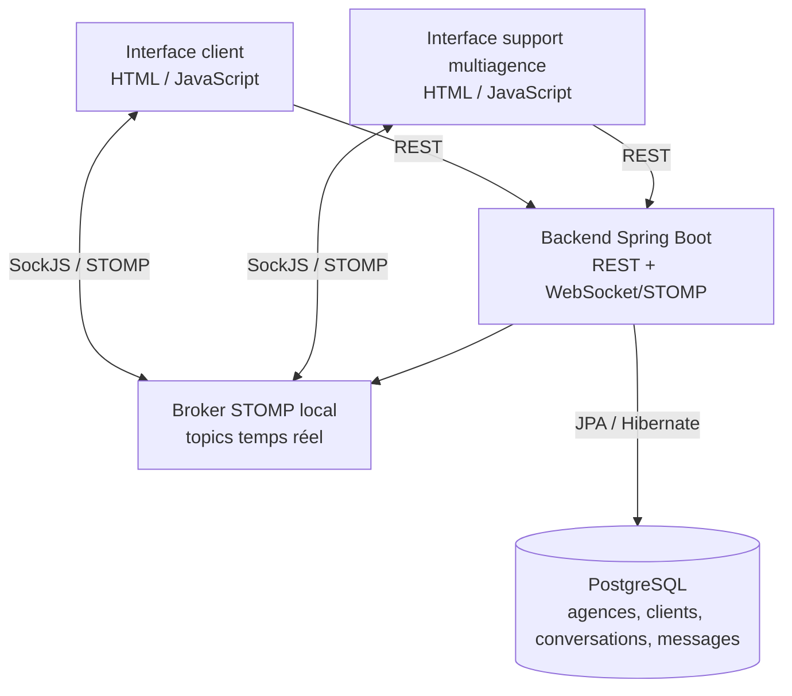
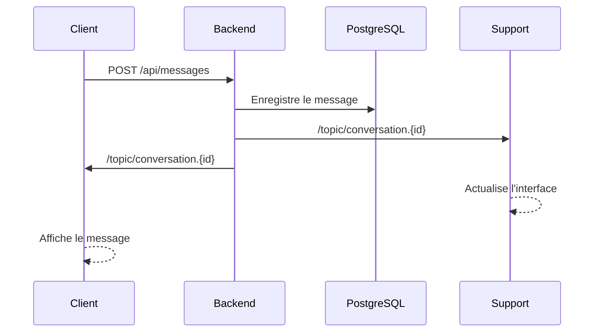

# POC Chat temps réel

## Objectif

Ce POC valide un échange temps réel entre des clients et un support multiagence de location, avec persistance des conversations et des messages.

Le périmètre couvre :

- un backend Java Spring Boot ;
- PostgreSQL pour les agences, comptes clients, conversations et messages ;
- WebSocket avec SockJS/STOMP pour les échanges temps réel ;
- une interface client web minimale ;
- une interface support multiagence web ;
- une exécution complète avec Docker Compose.

## Fonctionnalités

### Client

- connexion avec un compte de démonstration ;
- récupération automatique d'une conversation active après connexion ;
- choix d'une agence lorsqu'aucune conversation active n'existe ;
- envoi et réception de messages en temps réel ;
- affichage de l'historique persistant ;
- choix d'une nouvelle agence après clôture d'une conversation.

### Support

- sélection de l'agence prise en charge par le support ;
- chargement des conversations existantes depuis la base au démarrage ;
- séparation entre conversations actives et archivées ;
- affichage du client, de la date de création et du statut ;
- réception en temps réel des nouvelles conversations du support ;
- réception et envoi de messages en temps réel ;
- clôture d'une conversation par le support avec message automatique au client ;
- masquage du formulaire de réponse pour les conversations clôturées.

## Comptes de démonstration

Les deux comptes utilisent le même mot de passe : `mot de passe client`.

| Identifiant | Mot de passe |
|---|---|
| `client1` | `mot de passe client` |
| `client2` | `mot de passe client` |

Ces comptes sont destinés uniquement au POC. Le mot de passe est stocké en clair dans l'initialisation de démonstration et ne doit pas être conservé ainsi en production.

## Stack technique

- Java 17 pour la cible du projet ;
- Spring Boot 3.3.3 ;
- Spring WebSocket avec broker STOMP intégré ;
- Spring Data JPA / Hibernate ;
- PostgreSQL 16 ;
- HTML, CSS et JavaScript vanilla ;
- Docker et Docker Compose.

## Diagramme de composants



Le backend centralise les règles métier et la persistance. Le broker STOMP diffuse les messages des conversations et les événements de mise à jour des listes du support.

## Séquence d'envoi d'un message


## Installation et configuration

### Prérequis

- Docker Engine 24 ou une version récente avec Docker Compose v2 (`docker compose`) ;
- les ports `5433`, `8080`, `8081` et `8082` disponibles sur la machine ;
- un accès Internet lors du premier démarrage, afin de télécharger les images Docker, les dépendances Maven et les bibliothèques JavaScript chargées par les interfaces.

Vérifiez que Docker et Compose sont disponibles :

```bash
docker --version
docker compose version
```

### Variables de configuration

Docker Compose applique les valeurs par défaut suivantes. Elles peuvent être surchargées dans le shell ou dans un fichier `.env` placé dans le dossier `chat-poc`.

| Variable | Valeur par défaut | Description |
|---|---|---|
| `POSTGRES_DB` | `chat_poc` | Nom de la base PostgreSQL |
| `POSTGRES_USER` | `chatuser` | Utilisateur PostgreSQL |
| `POSTGRES_PASSWORD` | `chatpass` | Mot de passe PostgreSQL |
| `REALTIME_PROVIDER` | `local` | Fournisseur temps réel : `local` ou `azure` |
| `AZURE_WEB_PUBSUB_CONNECTION_STRING` | vide | Chaîne de connexion Azure Web PubSub, requise avec `REALTIME_PROVIDER=azure` |
| `AZURE_WEB_PUBSUB_HUB_NAME` | `chat` | Nom du hub Azure Web PubSub |

Exemple de fichier `.env` pour modifier les identifiants de base tout en conservant le broker local :

```dotenv
POSTGRES_DB=chat_poc
POSTGRES_USER=chatuser
POSTGRES_PASSWORD=un-mot-de-passe-local
REALTIME_PROVIDER=local
```

Ne versionnez pas un fichier `.env` contenant un secret Azure ou un mot de passe non dédié au POC.

## Démarrage

Depuis le dossier `chat-poc` :

```bash
docker compose up --build
```

Services disponibles :

- Client : http://localhost:8081
- Support : http://localhost:8082
- API backend : http://localhost:8080
- PostgreSQL : `localhost:5433` depuis l'hôte, `db:5432` depuis le réseau Docker

Après la construction initiale, attendez que les quatre conteneurs soient démarrés, puis ouvrez les interfaces Client et Support dans deux onglets distincts. Connectez-vous au client avec l'un des comptes de démonstration et sélectionnez une agence dans l'interface support pour échanger des messages.

Pour arrêter les conteneurs sans supprimer les données :

```bash
docker compose down
```

Pour réinitialiser complètement la base du POC :

```bash
docker compose down -v
docker compose up -d --build
```

La réinitialisation supprime toutes les conversations et tous les messages. Les agences et les deux comptes clients sont recréés automatiquement.

## Flux de conversation

1. Le client se connecte.
2. Le backend recherche une conversation `OPEN` pour ce client.
3. Si elle existe, elle est ouverte automatiquement avec son historique.
4. Sinon, le client choisit une agence et lance un chat.
5. Si une ancienne conversation est `CLOSED`, un nouveau chat est créé.
6. Le support peut répondre ou terminer la conversation.
7. La clôture ajoute le message : `conversation terminée, pour continuer à échanger, merci de lancer un nouveau chat`.
8. Le client peut sélectionner une agence et lancer une nouvelle conversation.

## Topics WebSocket

Messages d'une conversation :

```text
/topic/conversation.{conversationId}
```

Événements de liste pour le support d'une agence :

```text
/topic/agency.{agencyId}.conversations
```

Les événements de liste permettent à l'interface support d'actualiser les conversations actives et archivées sans rechargement.

## Principaux endpoints REST

| Méthode | Endpoint | Usage |
|---|---|---|
| `POST` | `/api/auth/login` | Authentifier un client |
| `GET` | `/api/agencies` | Lister les agences |
| `POST` | `/api/conversations/start` | Reprendre ou créer une conversation |
| `GET` | `/api/clients/{guestId}/active-conversation` | Récupérer la conversation active d'un client |
| `GET` | `/api/agencies/{agencyId}/conversations` | Charger l'historique du support pour une agence |
| `GET` | `/api/conversations/{id}/messages` | Charger les messages |
| `POST` | `/api/messages` | Envoyer un message |
| `POST` | `/api/conversations/{id}/close` | Terminer une conversation |

## Tests automatisés

Depuis `chat-poc/backend` :

```bash
mvn test
```

La suite couvre notamment :

- réutilisation d'une conversation active ;
- création d'une nouvelle conversation après clôture ;
- refus d'un message vide ;
- refus d'un accès client non autorisé ;
- refus d'un message sur une conversation fermée ;
- persistance du message de clôture ;
- authentification valide et invalide ;
- récupération ou absence de conversation active ;
- publication des événements WebSocket de clôture.

Les tests de navigation et de WebSocket entre deux interfaces ont également été validés manuellement avec les conteneurs locaux.

## Limites du POC

- authentification simplifiée, sans session ni JWT ;
- mot de passe de démonstration en clair ;
- interface support multiagence basée sur l'agence sélectionnée ;
- broker STOMP local en mémoire en mode `local` ;
- connexion Azure Web PubSub nécessitant une chaîne de connexion valide en mode `azure`.

## Connexion Azure Web PubSub

Le transport temps réel est isolé derrière `RealtimeMessagingPort`. Le fournisseur est sélectionné par la propriété :

```yaml
realtime:
	provider: ${REALTIME_PROVIDER:local}
```

Pour utiliser le broker local :

```bash
REALTIME_PROVIDER=local docker compose up -d --build
```

Pour connecter le chat à Azure Web PubSub :

```bash
export REALTIME_PROVIDER=azure
export AZURE_WEB_PUBSUB_CONNECTION_STRING="Endpoint=https://...;AccessKey=...;Version=1.0;"
export AZURE_WEB_PUBSUB_HUB_NAME=chat
docker compose up -d --build
```

En mode Azure, le backend publie les messages dans les groupes `conversation-{id}` et les événements de liste dans les groupes `agency-{id}`. Les interfaces obtiennent une URL temporaire via `/api/realtime/client-url`, puis ouvrent une WebSocket native vers Azure Web PubSub.

L'intégration utilise le SDK Java `azure-messaging-webpubsub`. Les secrets doivent être fournis par l'environnement ou un coffre de secrets, et ne doivent jamais être commités.

