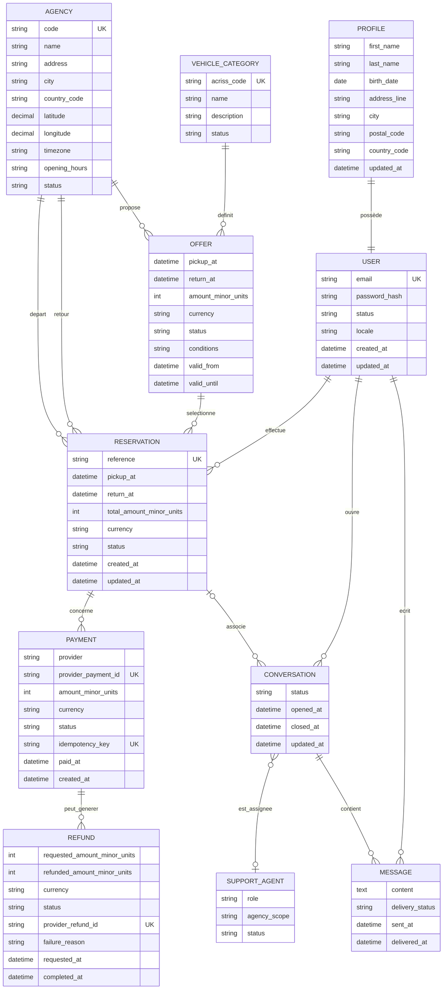

```mermaid
erDiagram
    SUPPORT_AGENT
    AGENCY ||--o{ RESERVATION : depart
    PROFILE ||--|| USER : possède
    USER ||--o{ RESERVATION : effectue
    USER ||--o{ CONVERSATION : ouvre
    AGENCY ||--o{ RESERVATION : retour
    OFFER ||--o{ RESERVATION : selectionne
    VEHICLE_CATEGORY ||--o{ OFFER : definit
    AGENCY ||--o{ OFFER : propose
    RESERVATION ||--o{ PAYMENT : concerne
    PAYMENT ||--o{ REFUND : peut_generer
    RESERVATION |o--o{ CONVERSATION : associe
    CONVERSATION }o--o| SUPPORT_AGENT : est_assignee
    CONVERSATION ||--o{ MESSAGE : contient
    USER ||--o{ MESSAGE : ecrit
    
    USER {
        string email UK
        string password_hash
        string status
        string locale
        datetime created_at
        datetime updated_at
    }
    PROFILE {
        string first_name
        string last_name
        date birth_date
        string address_line
        string city
        string postal_code
        string country_code
        datetime updated_at
    }
    AGENCY {
        string code UK
        string name
        string address
        string city
        string country_code
        decimal latitude
        decimal longitude
        string timezone
        string opening_hours
        string status
    }
    VEHICLE_CATEGORY {
        string acriss_code UK
        string name
        string description
        string status
    }
    OFFER {
        datetime pickup_at
        datetime return_at
        int amount_minor_units
        string currency
        string status
        string conditions
        datetime valid_from
        datetime valid_until
    }
    RESERVATION {
        string reference UK
        datetime pickup_at
        datetime return_at
        int total_amount_minor_units
        string currency
        string status
        datetime created_at
        datetime updated_at
    }
    PAYMENT {
        string provider
        string provider_payment_id UK
        int amount_minor_units
        string currency
        string status
        string idempotency_key UK
        datetime paid_at
        datetime created_at
    }
    REFUND {
        int requested_amount_minor_units
        int refunded_amount_minor_units
        string currency
        string status
        string provider_refund_id UK
        string failure_reason
        datetime requested_at
        datetime completed_at
    }
    CONVERSATION {
        string status
        datetime opened_at
        datetime closed_at
        datetime updated_at
    }
    MESSAGE {
        text content
        string delivery_status
        datetime sent_at
        datetime delivered_at
    }
    SUPPORT_AGENT {
        string role
        string agency_scope
        string status
    }
```
