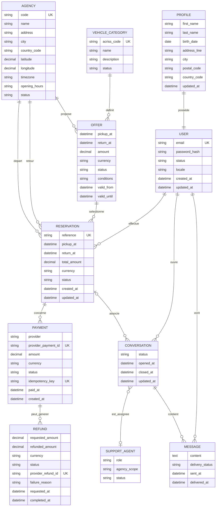

# Modèle de données

## Principes

Le modèle proposé utilise une base relationnelle transactionnelle. Les données communes sont centralisées, tandis que les règles ou paramètres propres à un pays sont identifiés explicitement.

- Les identifiants techniques sont des UUID ou un format équivalent non prédictible. 
- Les montants sont stockés avec une valeur décimale et une devise. 
- Les dates métier sont stockées au format UTC et converties lors de l'affichage.

## Diagramme entité-relation

## Description des principales entités

Toutes les entités possèdent un UUID.

### Utilisateur et profil

`USER` contient les informations nécessaires à l'authentification et à l'état du compte. `PROFILE` contient les informations personnelles modifiables. Le profil est séparé afin de limiter les accès aux données personnelles et de permettre leur reprise dans une réservation.

Contraintes :

- l'adresse e-mail est unique ;
- le mot de passe n'est jamais stocké en clair ;
- un utilisateur ne peut consulter ou modifier que son propre profil ;
- la suppression du compte respecte la politique de conservation et les règles concernant les réservations futures.

### Agence

`AGENCY` contient les informations d'affichage et de localisation. Le fuseau horaire est indispensable à l'interprétation des dates de départ et de retour.

Contraintes :

- le code d'agence est unique ;
- une agence inactive ne peut pas être proposée pour une nouvelle réservation ;
- les horaires et la disponibilité sont appliqués selon la zone de l'agence.

### Catégorie et offre

`VEHICLE_CATEGORY` référence les codes ACRISS. `OFFER` représente une possibilité tarifée pour une période, deux agences et une catégorie.

Contraintes :

- le code ACRISS est unique et validé ;
- une offre doit avoir une date de retour postérieure au départ ;
- le montant et la devise sont obligatoires ;
- une offre ne peut être réservée que si elle est disponible au moment de la confirmation.

### Réservation

`RESERVATION` conserve un instantané des informations importantes de l'offre au moment de la réservation. Cela permet de conserver l'historique même si l'offre d'origine est modifiée ou supprimée.

Contraintes :

- la référence est unique ;
- une réservation appartient à un seul client ;
- l'état suit les transitions définies dans les spécifications techniques ;
- les mutations critiques sont idempotentes, contrôlées par les droits et journalisées ;
- les dates, agences, catégorie, montant et devise utilisés au moment de la confirmation restent traçables.

### Paiement et remboursement

`PAYMENT` représente une opération auprès du prestataire externe. `REFUND` représente une demande et son résultat. Aucun numéro de carte ou secret bancaire ne doit être stocké.

Contraintes :

- l'identifiant du prestataire est unique ;
- un webhook accepté est traité de manière idempotente ;
- une réservation n'est confirmée qu'après paiement accepté ;
- pour une annulation à moins d'une semaine, le remboursement est limité à 25 % du montant total, sous réserve des règles validées ;
- le statut, les montants demandés et réellement remboursés et les erreurs sont conservés.

### Conversations et messages

`CONVERSATION` appartient à un client et peut être associée à une seule réservation. `MESSAGE` conserve l'ordre, l'auteur et l'état de remise.

Contraintes :

- seuls les participants et les personnes habilitées accèdent aux messages ;
- un message vide est refusé ;
- la clôture ne supprime pas l'historique ;
- l'affectation et le transfert respectent les permissions du conseiller ;
- les contenus et données conservés sont soumis à une durée de rétention à valider.

## Contraintes recommandés

- contrainte empêchant `return_at` d'être antérieur ou égal à `pickup_at` ;
- contrainte d'unicité sur les identifiants de paiement, remboursement et clés d'idempotence.

## Données à préciser avant implémentation

- modèle exact des disponibilités et gestion des allocations de véhicules ;
- granularité des tarifs et des taxes ;
- règles de conservation et anonymisation ;
- représentation des horaires d'ouverture et des jours fériés ;
- modèle de permissions par agence ;
- gestion des utilisateurs d'agence et des conseillers ;
- stratégie d'identifiants lors de la migration des bases existantes ;
- données nécessaires aux notifications et préférences de contact.
