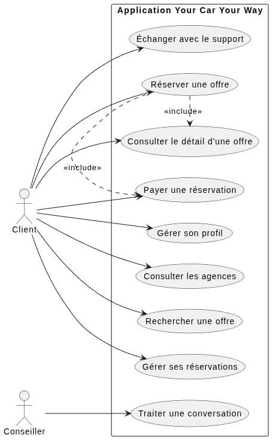
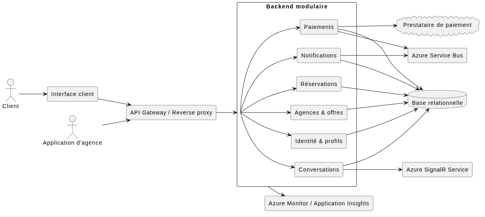
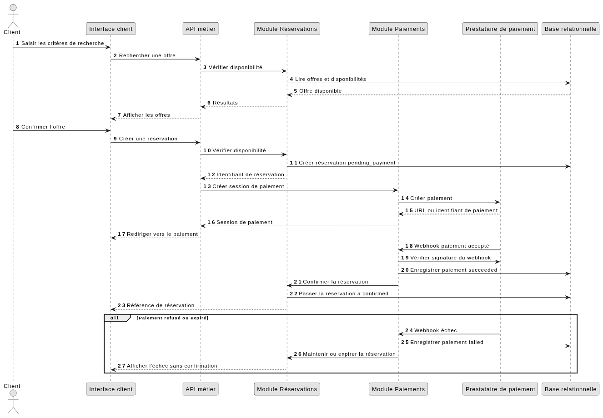
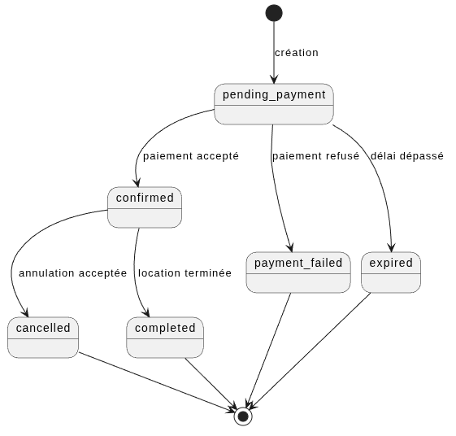
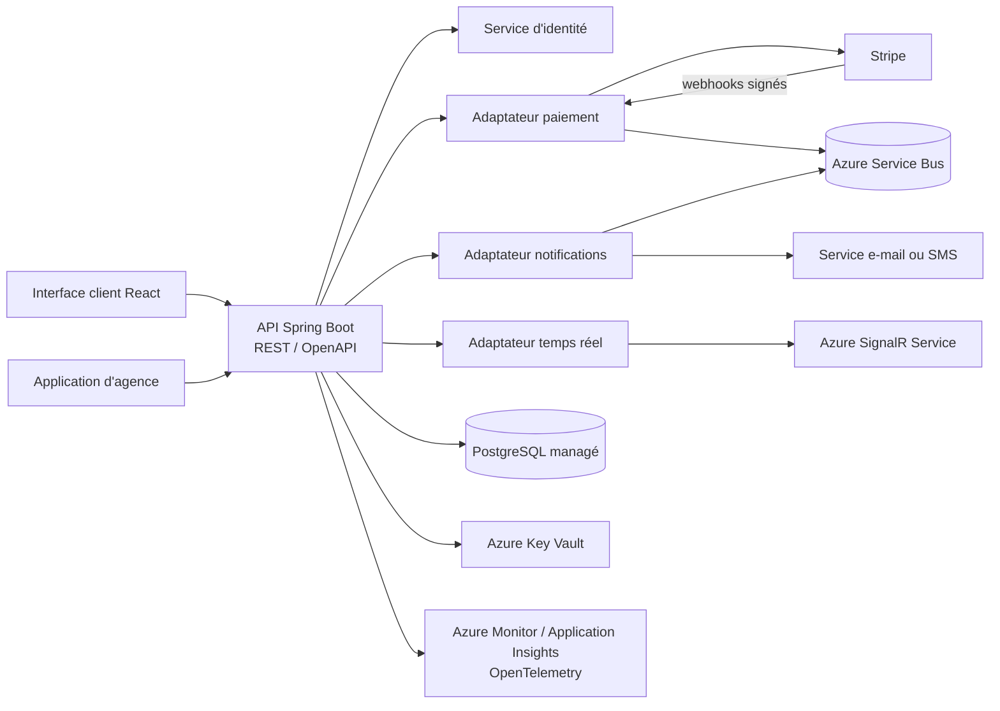
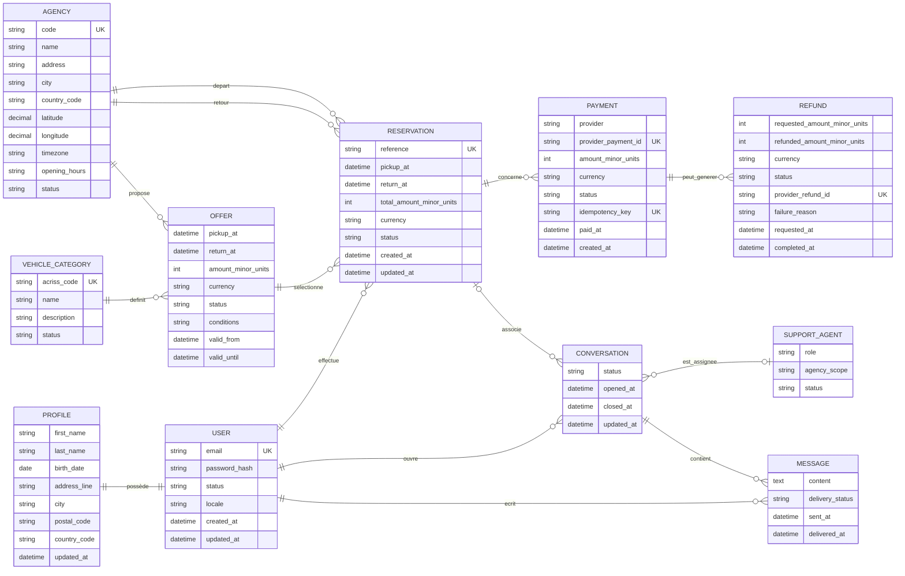

# Proposition d'architecture

<div style="page-break-after: always;"></div>

## Objet

Ce document contient un l'audit de l'existant, les spécifications techniques proposées et le modèle de données de la V1 de l'application Your Car Your Way.

La récupération, la migration et la synchronisation des données ou fonctionnalités de
l'existant sont hors périmètre de cette proposition. La V1 est conçue comme une
application autonome ; les éventuels travaux de reprise feront l'objet d'un projet
distinct.

<div style="page-break-after: always;"></div>

## 1. Audit de l'existant

### 1.1 Synthèse

Your Car Your Way dispose de plusieurs applications nationales développées indépendamment. L'architecture est majoritairement monolithique, les données sont isolées par pays et les APIs ne sont pas uniformisées.

Cette situation entraîne 

- une duplication du code
- une divergence des règles métier
- des coûts de maintenance élevés
- des niveaux de sécurité, de disponibilité et de fiabilité différents. 

La cible doit donc centraliser les contrats métier et les données nécessaires au parcours client, tout en isolant explicitement les règles locales.

### 1.2 Périmètre technique observé

| Périmètre | Technologie principale | Hébergement | Architecture |
| --- | --- | --- | --- |
| France | Java EE, JSP/JSF | OVH | Monolithe complet |
| Allemagne, Espagne, Italie | Java EE | OVH | Dérivés du produit français |
| Royaume-Uni | PHP Laravel | AWS EC2 | Monolithe isolé |
| Canada | React, Node.js | AWS | Frontend séparé, backend monolithique |
| États-Unis | Angular, Spring Boot | Azure App Services / Containers | Monolithe containerisé |

### 1.3 Principaux constats et risques

#### Risques fonctionnels et de cohérence métier

Ces risques concernent la cohérence du service et la similitude du parcours client entre les pays. Ils impactent directement la qualité de l'expérience utilisateur et la capacité à harmoniser les règles métier.

- Les APIs sont limitées, hétérogènes et non unifiées, ce qui complique la mise en place d'un parcours client cohérent à l'international.
- Chaque pays dispose d'une base avec un schéma différent, ce qui provoque des écarts de données et de règles métier entre pays.
- Le partage d'informations est absent ou réalisé manuellement, ce qui ralentit les traitements et augmente le risque d'erreurs.
- Les règles de réservation et de gestion du service divergent selon les pays, ce qui réduit l'homogénéité de l'expérience client.

#### Risques de données et d'intégration

Ces risques portent sur la fragmentation des données et les échanges entre systèmes, ce qui limite la fiabilité et la vitesse de traitement des opérations transverses.

- Les bases sont isolées par pays avec des schémas hétérogènes, ce qui limite l'interopérabilité et la centralisation des données.
- Les échanges entre applications sont insuffisants ou non automatisés, ce qui augmente les délais et les risques de manipulation manuelle.
- Les sauvegardes historiques sont manuelles et les restaurations ne sont pas régulièrement testées, rendant la reprise d'activité moins fiable.

#### Risques de sécurité et conformité

Ces risques concernent la protection des données, la conformité technique et la résilience face aux menaces externes. Ils peuvent entraîner des violations de sécurité, des pertes de confiance et des coûts de correction importants.

- SHA-1 est encore utilisé pour les mots de passe sur FR/DE/ES/IT et TLS 1.0 subsiste en France et en Italie, ce qui augmente le risque de compromission.
- Des secrets sont stockés dans des fichiers de configuration et la rotation n'est pas homogène, ce qui fragilise la sécurité des intégrations.
- Les dépendances présentant des vulnérabilités sont particulièrement nombreuses sur les environnements historiques, augmentant le risque d'exploitation.

#### Risques de disponibilité, performance et exploitation

Ces risques affectent la stabilité du service lors des pics de charge et la capacité de l'équipe à déployer et gérer les environnements de manière fiable.

- Les performances et la disponibilité sont hétérogènes : disponibilité annoncée de 97,2 % à 98,9 %, MTTR d'environ 2 h 45 sur OVH contre 1 h 10 sur AWS/Azure.
- Les pics saisonniers provoquent jusqu'à 4 % d'erreurs sur FR/DE/ES/IT, ce qui peut impacter directement la conversion et la satisfaction client.
- Les déploiements historiques sont manuels ; les environnements cloud sont plus standardisés, ce qui crée une différence de maturité opérationnelle et de fiabilité.

#### Risques de gouvernance et de maintenance

Ces risques concernent le coût de possession, la complexité de maintenance et la capacité à faire évoluer le système sans dériver techniquement entre pays.

- La duplication du code et la dépendance à plusieurs implémentations nationales augmentent le coût de maintenance et la difficulté de mise à jour.
- L'absence d'un modèle de données et d'un contrat API commun complique la montée en charge, la supervision et le pilotage technique du portefeuille applicatif.
- Les environnements historiques ne disposent pas d'une base de référence sûre pour la sécurité, la reprise et la gestion des vulnérabilités.

### 1.4 Recommandations de transition

| Recommandation | Risques associés |
| --- | --- |
| Définir un modèle métier et un contrat API communs. | Risques fonctionnels et de cohérence métier <br> Risques de gouvernance et de maintenance |
| Centraliser les règles communes et isoler les règles locales par pays. | Risques fonctionnels et de cohérence métier <br> Risques de gouvernance et de maintenance |
| Sécuriser en priorité les mots de passe, TLS, secrets et dépendances. | Risques de sécurité et conformité |
| Automatiser les déploiements, sauvegardes, contrôles et tests de restauration. | Risques de données et d'intégration <br> Risques de disponibilité, performance et exploitation |
| Définir les objectifs de disponibilité, performance, RPO et RTO. | Risques de disponibilité, performance et exploitation |
| Réaliser un pilote sur un périmètre limité avant la généralisation. | Risques de gouvernance et de maintenance <br> Risques de données et d'intégration |

<div style="page-break-after: always;"></div>

## 2. Spécifications techniques

### 2.1 Architecture cible proposée

La cible recommandée est un 

- backend modulaire centralisé
- déployé sous forme de conteneurs stateless sur Azure
- derrière un reverse proxy ou un load balancer. 

Cette orientation reprend le meilleur retour d'expérience de l'environnement américain tout en supprimant ses limites identifiées. 
Les modules partagent une base relationnelle managée et possèdent des responsabilités et des contrats séparés.

Modules fonctionnels proposés :

- identité et profils
- agences et offres
- réservations
- paiements et remboursements
- notifications
- conversations et messages
- intégrations avec les prestataires externes nécessaires au parcours cible

Cette architecture pourra évoluer vers des services séparés si la charge ou les contraintes d'isolation le justifient, sans imposer une complexité supplémentaire dès la V1.

<div style="page-break-after: always;"></div>

### 2.3 Diagrammes UML

#### Cas d'utilisation



<!-- 
```plantuml
@startuml use_cases
left to right direction
skinparam monochrome true
skinparam shadowing false
actor Client
actor Conseiller

rectangle "Application Your Car Your Way" {
  usecase "Gérer son profil" as UC_Profile
  usecase "Consulter les agences" as UC_Agencies
  usecase "Rechercher une offre" as UC_Search
  usecase "Consulter le détail d'une offre" as UC_Offer
  usecase "Réserver une offre" as UC_Book
  usecase "Payer une réservation" as UC_Pay
  usecase "Gérer ses réservations" as UC_Reservations
  usecase "Échanger avec le support" as UC_Chat
  usecase "Traiter une conversation" as UC_Support
}

Client -- > UC_Profile
Client -- > UC_Agencies
Client -- > UC_Search
Client -- > UC_Offer
Client -- > UC_Book
Client -- > UC_Pay
Client -- > UC_Reservations
Client -- > UC_Chat
Conseiller -- > UC_Support

UC_Book .> UC_Offer : <<include>>
UC_Book .> UC_Pay : <<include>>
@enduml
```
-->

<div style="page-break-after: always;"></div>

#### Architecture logique


<!-- 
```plantuml
@startuml components
left to right direction
skinparam monochrome true
skinparam shadowing false
skinparam componentStyle rectangle

actor Client
actor "Application d'agence" as AgencyApp

component "Interface client" as Frontend
component "API Gateway / Reverse proxy" as Gateway
component "Backend modulaire" as Backend {
  component "Identité & profils" as Identity
  component "Agences & offres" as Catalog
  component "Réservations" as Booking
  component "Paiements" as Payments
  component "Conversations" as Chat
    component "Notifications" as Notifications
}
database "Base relationnelle" as DB
component "Azure Service Bus" as Queue
component "Azure SignalR Service" as Realtime
component "Azure Monitor / Application Insights" as Observability
cloud "Prestataire de paiement" as Payment

Client -- > Frontend
AgencyApp -- > Gateway
Frontend -- > Gateway
Gateway -- > Backend
Backend -- > Identity
Backend -- > Catalog
Backend -- > Booking
Backend -- > Payments
Backend -- > Chat
Backend -- > Notifications
Identity -- > DB
Catalog -- > DB
Booking -- > DB
Payments -- > DB
Chat -- > DB
Notifications -- > DB
Payments -- > Queue
Notifications -- > Queue
Chat -- > Realtime
Payments -- > Payment
Backend -- > Observability
@enduml
``` 
-->

<div style="page-break-after: always;"></div>

#### Séquence de réservation et de paiement


<!-- 
```plantuml
@startuml booking_sequence
autonumber
skinparam monochrome true
skinparam shadowing false
actor Client
participant "Interface client" as UI
participant "API métier" as API
participant "Module Réservations" as Booking
participant "Module Paiements" as Payments
participant "Prestataire de paiement" as PSP
participant "Base relationnelle" as DB

Client -> UI : Saisir les critères de recherche
UI -> API : Rechercher une offre
API -> Booking : Vérifier disponibilité
Booking -> DB : Lire offres et disponibilités
DB -- > Booking : Offre disponible
Booking -- > API : Résultats
API -- > UI : Afficher les offres

Client -> UI : Confirmer l'offre
UI -> API : Créer une réservation
API -> Booking : Vérifier disponibilité
Booking -> DB : Créer réservation pending_payment
Booking -- > API : Identifiant de réservation
API -> Payments : Créer session de paiement
Payments -> PSP : Créer paiement
PSP -- > Payments : URL ou identifiant de paiement
Payments -- > API : Session de paiement
API -- > UI : Rediriger vers le paiement

PSP -> Payments : Webhook paiement accepté
Payments -> PSP : Vérifier signature du webhook
Payments -> DB : Enregistrer paiement succeeded
Payments -> Booking : Confirmer la réservation
Booking -> DB : Passer la réservation à confirmed
Booking -- > UI : Référence de réservation

alt Paiement refusé ou expiré
  PSP -> Payments : Webhook échec
  Payments -> DB : Enregistrer paiement failed
  Payments -> Booking : Maintenir ou expirer la réservation
  Booking -- > UI : Afficher l'échec sans confirmation
end
@enduml
``` -->

<div style="page-break-after: always;"></div>

#### États d'une réservation


<!-- 
```plantuml
@startuml reservation_states
skinparam monochrome true
skinparam shadowing false
[*] -- > pending_payment : création
pending_payment -- > confirmed : paiement accepté
pending_payment -- > payment_failed : paiement refusé
pending_payment -- > expired : délai dépassé
confirmed -- > cancelled : annulation acceptée
confirmed -- > completed : location terminée
cancelled -- > [*]
payment_failed -- > [*]
expired -- > [*]
completed -- > [*]
@enduml
``` 
-->

### 2.4 Composants techniques

| Composant | Responsabilité | Solution recommandée |
| --- | --- | --- |
| Interface client | Profil, recherche, réservation, paiement, historique et tchat | React avec une bibliothèque de composants accessible et internationalisable |
| API métier | Authentification, règles métier et exposition des ressources | Spring Boot modulaire et REST versionnée avec OpenAPI |
| Base relationnelle | Données transactionnelles et cohérence des réservations | PostgreSQL managé en haute disponibilité |
| Cache et verrous | Cache de lecture et coordination des vérifications de disponibilité | Redis ou service équivalent |
| Bus ou file de messages | Notifications, webhooks et traitements asynchrones | Azure Service Bus |
| Prestataire de paiement | Paiement et remboursement | Prestataire externe tel que Stripe |
| Service temps réel | Messages du tchat et événements de conversation | Azure SignalR Service |
| Fournisseur de notifications | E-mail, SMS ou autre canal validé | Service de notification derrière un adaptateur |
| Déploiement | Exécution et livraison applicative | Azure avec conteneurs et chaîne CI/CD reproductible |
| Observabilité | Logs, métriques, traces et alertes | Azure Monitor et Application Insights avec instrumentation OpenTelemetry |
| Coffre de secrets | Secrets applicatifs et clés d'intégration | Azure Key Vault généralisé à tous les environnements |

### 2.5 API

Principes :

- L'API est exposée sous un préfixe versionné, par exemple `/api/v1`.
- Les réponses et erreurs suivent un format documenté et homogène.
- Les dates sont transmises dans un format normalisé avec le fuseau ou l'identifiant de zone nécessaire.
- Les montants sont transmis comme un entier exprimé dans l'unité minimale de la devise, avec une devise explicite.
- Les listes prennent en charge la pagination, le filtrage et le tri documentés.
- Le contrat est publié avec OpenAPI et versionné avec le code.

Les droits sont contrôlés côté serveur pour chaque ressource et chaque action.

### 2.6 Réservation et paiement

1. L'offre est relue et sa disponibilité est vérifiée au moment de la confirmation.
2. Une tentative de réservation est créée avec un état non confirmé.
3. Une session de paiement est créée auprès du prestataire externe.
4. Le résultat du paiement est reçu par retour utilisateur et par webhook vérifié.
5. Le webhook idempotent est la source de confirmation du paiement.
6. La réservation passe à l'état confirmée uniquement après paiement accepté.
7. Un paiement échoué ou expiré laisse une trace exploitable sans créer de réservation confirmée.

La réservation et la confirmation de disponibilité doivent être protégées contre les doubles réservations par transaction, verrouillage court ou mécanisme équivalent.

États minimaux :

- réservation : `pending_payment`, `confirmed`, `cancelled`, `completed`, `payment_failed`, `expired` ;
- paiement : `created`, `pending`, `succeeded`, `failed`, `refunded`, `partially_refunded` ;
- conversation : `open`, `assigned`, `closed`.

Pour une annulation effectuée moins d'une semaine avant le début de la location, le montant remboursé est limité à 25 % du montant total, sous réserve des règles complémentaires validées. Le montant demandé au prestataire, le montant réellement remboursé, l'état du remboursement et les erreurs doivent être conservés.

### 2.7 Sécurité

- TLS 1.0 et les protocoles obsolètes sont interdits.
- Mots de passe stockés avec un algorithme adaptatif moderne, par exemple Argon2id ou bcrypt.
- Secrets stockés dans un coffre dédié, jamais dans le dépôt ou des fichiers versionnés.
- Vérification de signature et d'anti-rejeu pour les webhooks de paiement.
- Contrôle d'accès côté serveur, journalisation des refus et limitation des tentatives sensibles.
- Données bancaires non stockées par l'application.
- Logs exempts de mots de passe, secrets et données bancaires.

### 2.8 Disponibilité, performance et résilience

La cible doit prévoir :

- plusieurs instances applicatives lorsque le niveau de disponibilité le requiert ;
- une base sauvegardée automatiquement et une procédure de restauration testée ;
- une stratégie de reprise documentée avec RPO et RTO validés ;
- des timeouts, réexécutions limités et possibilité d'annulation pour les dépendances externes ;
- une file ou un mécanisme de reprise pour les notifications et traitements asynchrones ;
- des tests de charge sur les parcours de recherche, réservation et paiement ;
- une gestion explicite des erreurs de dépendance et des réponses dégradées.

### 2.9 Observabilité, accessibilité et écoconception

#### Observabilité

Les événements et métriques doivent suivre 

- la disponibilité
- la latence
- les erreurs
- les réservations
- les paiements
- les remboursements
- les appels API
- les conversations
- les déploiements
- les sauvegardes et les restaurations

#### Accessibilité

Les tests et critères de conformité seront définis dans les spécifications détaillées en se basant sur le référentiel d'accessibilité WCAG.

#### Eco conception

Les interfaces et APIs doivent limiter les volumes transférés, éviter les traitements inutiles et permettre le suivi du poids des principaux parcours. 

Les durées de conservation des données et logs doivent être limitées selon les obligations métier et réglementaires.

### 2.10 Déploiement et tests

- Le code est versionné et construit par une chaîne d'intégration continue.
- Les contrôles de qualité, tests et analyses de dépendances sont automatisés.
- Les environnements de développement, recette et production sont séparés.
- Les configurations et secrets sont injectés par l'environnement.
- Les tests couvrent 
    - les règles métier
    - l'intégration
    - les contrats API
    - les parcours
    - les autorisations
    - la résilience
    - la charge
    - l'accessibilité 
    - la restauration

### 2.11 Sélection et justification des solutions technologiques

Les choix sont orientés par les résultats observés dans l'existant. 

1. **Les environnements cloud** obtiennent de meilleurs résultats que les environnements OVH historiques sur la disponibilité, le MTTR, la réussite des déploiements et la stabilisation après mise à jour. 
1. Le périmètre américain est le plus performant; il est également le seul à combiner **conteneurisation** et **déploiement Azure**. 
- Le Canada apporte le meilleur retour d'expérience sur l'expérience utilisateur avec **React**.

La cible reprend donc le socle cloud et conteneurisé du périmètre américain, renforce l'usage d'Azure Key Vault qui n'y est que partiel, et s'inspire du frontend React canadien pour l'expérience client. 

| Domaine | Solution proposée | Justification |
| --- | --- | --- |
| Frontend | React, avec une bibliothèque de composants accessible et internationalisable | Le Canada fournit le meilleur retour d'expérience UX de l'existant ; React permet de capitaliser sur cette expérience tout en mutualisant l'interface client internationale |
| Backend | Spring Boot modulaire | Le périmètre américain associe Spring Boot à la meilleure performance observée ; la modularité centralise les règles métier sans imposer la complexité opérationnelle de microservices dès la V1 |
| API | REST versionnée avec contrat OpenAPI | Compatible avec les applications web et d'agence, testable et documentable |
| Base de données | PostgreSQL managé en haute disponibilité | Une base relationnelle est nécessaire pour les transactions et contraintes des réservations ; le service managé réduit les opérations manuelles constatées dans l'existant |
| Cache et verrous | Redis ou service équivalent, uniquement pour les usages nécessaires | Réduit la latence et aide à coordonner les vérifications de disponibilité |
| Traitements asynchrones | Azure Service Bus avec files/topics et dead-letter queue | Découple notifications, webhooks et traitements pouvant être rejoués, tout en isolant les messages en échec |
| Temps réel | Azure SignalR Service | Fournit les connexions temps réel du tchat et des événements sans gérer directement la montée en charge des connexions WebSocket |
| Paiement | Prestataire externe tel que Stripe | Évite le stockage des données bancaires et fournit des APIs de paiement et remboursement |
| Déploiement | Azure avec conteneurs et chaîne CI/CD reproductible | Le périmètre américain, déployé sur Azure avec des conteneurs, obtient les meilleurs indicateurs de disponibilité, charge, erreurs et stabilisation ; cette approche corrige les déploiements manuels OVH |
| Gestion des secrets | Azure Key Vault généralisé à tous les environnements | Le périmètre américain utilise déjà Key Vault pour l'API ; sa généralisation corrige le stockage de secrets en fichiers |
| Observabilité | Azure Monitor et Application Insights avec instrumentation OpenTelemetry | Centralise les logs, métriques, traces distribuées, alertes et tableaux de bord des opérations sensibles |

Le choix final devra être documenté dans une matrice de décision comprenant les critères, la pondération, les options étudiées.

### 2.12 Modélisation de l'intégration des composants tiers

Les composants tiers sont intégrés derrière des adaptateurs dédiés afin d'isoler leurs contrats, leurs erreurs et leurs évolutions du coeur métier. Les appels externes doivent être authentifiés, limités dans le temps, journalisés avec un identifiant et protégés par des timeouts, réexécutions limités et possibilité d'annulation.



Principes d'intégration :

- les webhooks de paiement sont rejouables sans double confirmation ;
- les indisponibilités d'un service externe produisent un état explicite et ne doivent pas confirmer une réservation à tort ;
- les clés, certificats, URLs et identifiants de prestataires sont fournis par la configuration sécurisée de l'environnement ;
- les contrats des intégrations sont testés avec des tests de contrat et des environnements de test des fournisseurs.

### 2.13 Bonnes pratiques transverses

#### Sécurité, accessibilité et impact écologique

Les exigences détaillées sont définies dans les sections [Sécurité](#27-sécurité) et [Observabilité, accessibilité et écoconception](#29-observabilité-accessibilité-et-écoconception). Les bonnes pratiques suivantes guident leur mise en oeuvre :

- appliquer le principe du moindre privilège et tracer les opérations sensibles ;
- intégrer les contrôles de sécurité, d'accessibilité et de sobriété dans la conception, le développement, les tests et l'exploitation ;
- analyser les dépendances, les configurations et les images de déploiement à chaque livraison ;
- suivre les métriques et définir des actions si nécessaire.

<div style="page-break-after: always;"></div>

## 3. Modèle de données

### 3.1 Principes

Le modèle proposé utilise une base relationnelle transactionnelle. Les données communes sont centralisées, tandis que les règles ou paramètres propres à un pays sont identifiés explicitement.

- Les identifiants techniques sont des UUID ou un format équivalent non prédictible.
- Les montants sont stockés comme des entiers exprimés dans l'unité minimale de la devise, avec une devise explicite.
- Les dates métier sont stockées au format UTC et converties lors de l'affichage.

### 3.2 Diagramme entité-relation

> Pour simplifier les diagramme, les PK et FK ne sont pas représentées



### 3.3 Entités et contraintes

#### Utilisateur et profil

`USER` contient les informations d'authentification et l'état du compte. `PROFILE` contient les informations personnelles modifiables.

- L'adresse e-mail est unique.
- Le mot de passe n'est jamais stocké en clair.
- Un utilisateur ne peut consulter ou modifier que son propre profil.
- La suppression du compte respecte la politique de conservation et les règles concernant les réservations futures.

#### Agence, catégorie et offre

`AGENCY` contient les informations d'affichage et de localisation. Le fuseau horaire est indispensable à l'interprétation des dates. `VEHICLE_CATEGORY` référence les codes ACRISS. `OFFER` représente une possibilité tarifée pour une période, deux agences et une catégorie.

- Le code d'agence et le code ACRISS sont uniques.
- Une agence inactive ne peut pas être proposée pour une nouvelle réservation.
- Une offre doit avoir une date de retour postérieure au départ.
- Le montant et la devise sont obligatoires.
- Une offre ne peut être réservée que si elle est disponible au moment de la confirmation.

#### Réservation

`RESERVATION` conserve un instantané des informations importantes de l'offre au moment de la réservation afin de préserver l'historique.

- La référence est unique et une réservation appartient à un seul client.
- L'état suit les transitions définies dans les spécifications techniques.
- Les modifications critiques sont idempotentes, contrôlées par les droits et journalisées.
- Les dates, agences, catégorie, montant et devise utilisés à la confirmation restent traçables.

#### Paiement et remboursement

`PAYMENT` représente une opération auprès du prestataire externe. `REFUND` représente une demande et son résultat. Aucun numéro de carte ni secret bancaire ne doit être stocké.

- L'identifiant du prestataire est unique.
- Un webhook accepté est traité de manière idempotente.
- Une réservation n'est confirmée qu'après paiement accepté.
- Une annulation à moins d'une semaine entraîne un remboursement limité à 25 % du montant total, sous réserve des règles validées.
- Les montants demandés et réellement remboursés, le statut et les erreurs sont conservés.

#### Conversations

`CONVERSATION` appartient à un client et peut être associée à une seule réservation. `MESSAGE` conserve l'ordre, l'auteur et l'état de remise.

- Seuls les participants et les personnes habilitées accèdent aux messages.
- Un message vide est refusé.
- La clôture ne supprime pas l'historique.
- L'affectation et le transfert respectent les permissions du conseiller.
- Les contenus conservés sont soumis à une durée de rétention à valider.
