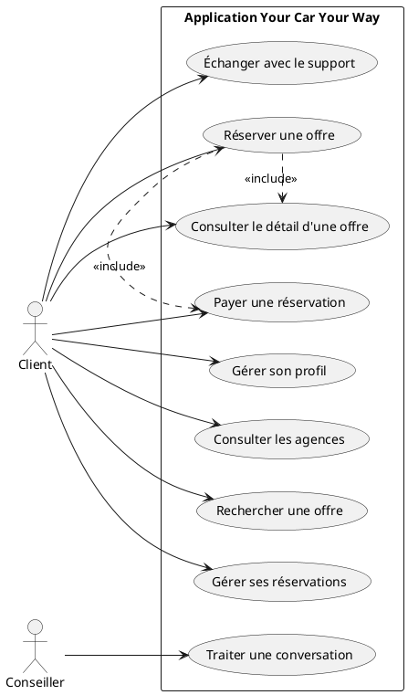
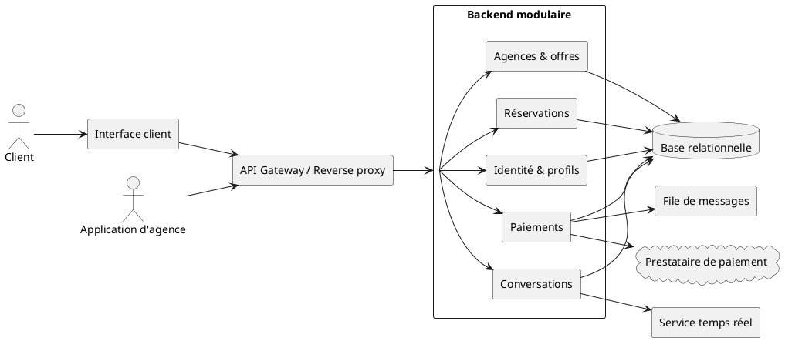
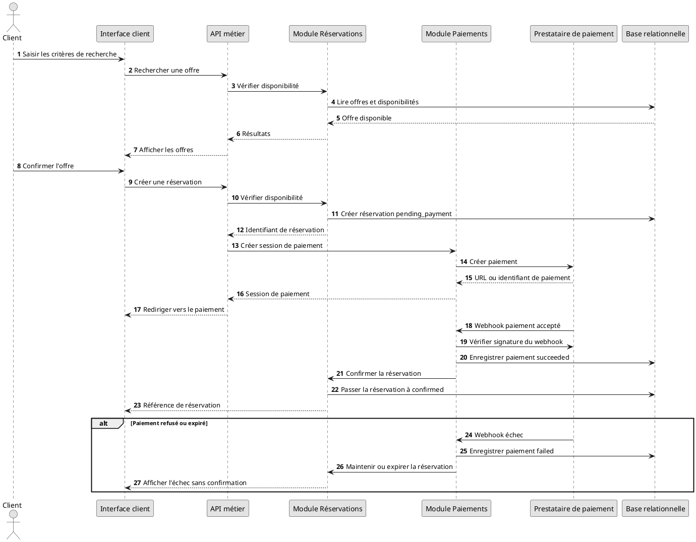
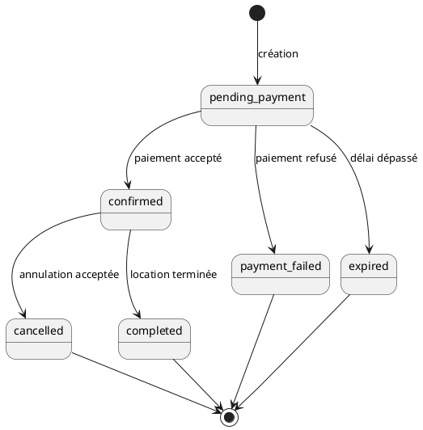

# Spécifications techniques

## Objet

Ce document traduit le cahier des charges fonctionnel et l'audit de l'existant en exigences techniques pour la V1 de l'application Your Car Your Way.

Les choix proposés constituent une base de conception. Les éléments indiqués comme « à valider » doivent être arbitrés avant le développement.

## Principes directeurs

- Centraliser les contrats métier, les règles communes et les données nécessaires au parcours client.
- Isoler les règles locales par pays sans dupliquer le cœur fonctionnel.
- Exposer une API versionnée et sécurisée pour l'application client et les applications en agence.
- Préférer une architecture modulaire et déployable simplement pour la V1.
- Rendre les opérations de paiement, réservation, modification et annulation idempotentes et traçables.
- Automatiser les tests, les déploiements, les sauvegardes et les contrôles de sécurité.

## Architecture cible proposée

### Vue d'ensemble

La cible recommandée est un backend modulaire centralisé, déployé comme une application stateless derrière un reverse proxy ou un load balancer. Les modules partagent une base relationnelle mais possèdent des responsabilités et des contrats séparés.

Modules fonctionnels proposés :

- identité et profils ;
- agences ;
- catalogue des catégories et offres ;
- disponibilité ;
- réservations ;
- paiements et remboursements ;
- notifications ;
- conversations et messages ;
- administration technique et audit ;
- adaptateurs de migration et d'intégration avec les systèmes existants.

Cette architecture pourra évoluer vers des services séparés si la charge, l'organisation ou les contraintes d'isolation le justifient. La séparation des modules doit être conçue dès la V1 pour éviter un nouveau monolithe indifférencié.

### Diagrammes UML

#### Cas d'utilisation

#### Architecture logique

#### Séquence de réservation et de paiement

#### États d'une réservation

### Composants techniques

| Composant | Responsabilité | Choix à valider |
| --- | --- | --- |
| Interface client | Profil, recherche, réservation, paiement, historique et tchat | Framework frontend commun à choisir |
| API métier | Authentification, règles métier et exposition des ressources | Runtime et framework backend à choisir |
| Base relationnelle | Données transactionnelles et cohérence des réservations | PostgreSQL recommandé |
| Bus ou file de messages | Notifications, webhooks et traitements asynchrones | À dimensionner selon le volume |
| Prestataire de paiement | Paiement et remboursement | Stripe ou prestataire retenu |
| Service temps réel | Messages du tchat et événements de conversation | WebSocket ou service managé |
| Fournisseur de notifications | E-mail, SMS ou autre canal validé | À arbitrer |
| Observabilité | Logs, métriques, traces et alertes | Outils à choisir avec l'exploitation |
| Coffre de secrets | Secrets applicatifs et clés d'intégration | Service managé de l'hébergeur ou équivalent |

## API

### Principes

- L'API est exposée sous un préfixe versionné, par exemple `/api/v1`.
- Les réponses et erreurs suivent un format documenté et homogène.
- Les dates sont transmises dans un format normalisé avec le fuseau ou l'identifiant de zone nécessaire.
- Les montants sont transmis comme une valeur décimale entière avec une devise explicite.
- Les listes prennent en charge la pagination, le filtrage et le tri documentés.
- Les endpoints de création et de mutation critiques acceptent une clé d'idempotence.
- Le contrat est publié avec OpenAPI et versionné avec le code.

### Ressources minimales

- `/users` et `/profiles` ;
- `/agencies` ;
- `/vehicle-categories` ;
- `/offers` et `/searches` ;
- `/reservations` ;
- `/payments` et `/refunds` ;
- `/conversations` et `/messages` ;
- `/notifications` selon le canal retenu.

### Autorisation

Les droits sont contrôlés côté serveur pour chaque ressource et chaque action. Les rôles minimaux à préciser sont :

- client : accès à ses propres données et conversations ;
- application d'agence : accès aux domaines et agences autorisés ;
- conseiller : accès aux conversations de son périmètre ;
- administrateur technique : accès aux fonctions d'exploitation strictement nécessaires.

Les permissions détaillées, le modèle de délégation et les limites par agence restent à valider.

## Réservation et paiement

### Cohérence transactionnelle

1. L'offre est relue et sa disponibilité est vérifiée au moment de la confirmation.
2. Une tentative de réservation est créée avec un état non confirmé.
3. Une session de paiement est créée auprès du prestataire externe.
4. Le résultat du paiement est reçu par retour utilisateur et par webhook vérifié.
5. Le webhook idempotent est la source de confirmation du paiement.
6. La réservation passe à l'état confirmée uniquement après paiement accepté.
7. Un paiement échoué ou expiré laisse une trace exploitable sans créer de réservation confirmée.

La réservation et la confirmation de disponibilité doivent être protégées contre les doubles réservations par transaction, verrouillage court ou mécanisme équivalent.

### États minimaux

- réservation : `pending_payment`, `confirmed`, `cancelled`, `completed`, `payment_failed`, `expired` ;
- paiement : `created`, `pending`, `succeeded`, `failed`, `refunded`, `partially_refunded` ;
- conversation : `open`, `assigned`, `closed`.

Les transitions autorisées et les règles de concurrence doivent être documentées dans le contrat métier.

### Remboursement

Pour une annulation effectuée moins d'une semaine avant le début de la location, le montant remboursé est limité à 25 % du montant total, sous réserve des règles complémentaires validées. Le montant demandé au prestataire, le montant réellement remboursé, l'état du remboursement et les erreurs doivent être conservés.

## Sécurité

- TLS actuel et sécurisé uniquement ; TLS 1.0 et les protocoles obsolètes sont interdits.
- Mots de passe stockés avec un algorithme adaptatif moderne, par exemple Argon2id ou bcrypt configuré selon les recommandations en vigueur.
- Migration progressive des mots de passe historiques sans conservation ni transmission en clair.
- Secrets stockés dans un coffre dédié, jamais dans le dépôt ou des fichiers de configuration versionnés.
- Authentification renforcée pour les actions sensibles.
- Vérification de signature et d'anti-rejeu pour les webhooks de paiement.
- Contrôle d'accès côté serveur, journalisation des refus et limitation des tentatives sensibles.
- Dépendances inventoriées et analysées automatiquement.
- Données bancaires non stockées par l'application.
- Logs exempts de mots de passe, secrets, données bancaires et contenus sensibles non nécessaires.

## Disponibilité, performance et résilience

Les objectifs chiffrés doivent être validés avant la production. La cible doit au minimum prévoir :

- plusieurs instances applicatives lorsque le niveau de disponibilité le requiert ;
- une base sauvegardée automatiquement et une procédure de restauration testée ;
- une stratégie de reprise documentée avec RPO et RTO validés ;
- des timeouts, retries bornés et circuit breakers pour les dépendances externes ;
- une file ou un mécanisme de reprise pour les notifications et traitements asynchrones ;
- des tests de charge sur les parcours de recherche, réservation et paiement ;
- une gestion explicite des erreurs de dépendance et des réponses dégradées.

## Observabilité

Les événements et métriques doivent permettre de suivre :

- disponibilité, latence, taux d'erreur et saturation ;
- recherches, offres affichées et réservations ;
- paiements, webhooks et remboursements ;
- modifications, annulations et conflits de disponibilité ;
- appels API par client, rôle, endpoint et résultat ;
- conversations, messages, transferts et échecs d'envoi ;
- déploiements, migrations, sauvegardes et restaurations.

Chaque opération sensible doit avoir un identifiant de corrélation et une trace horodatée. Les données personnelles doivent être minimisées dans les logs.

## Accessibilité et écoconception

Le référentiel d'accessibilité applicable, par exemple le RGAA ou les WCAG, doit être validé avant le développement. Les tests et critères de conformité seront définis dans les spécifications détaillées.

Les interfaces et APIs doivent limiter les volumes transférés, éviter les traitements inutiles et permettre le suivi du poids des principaux parcours. Les durées de conservation des données et logs doivent être limitées selon les obligations métier et réglementaires.

## Déploiement et migration

- Le code est versionné et construit par une chaîne d'intégration continue.
- Les contrôles de qualité, tests, analyse des dépendances et migrations sont exécutés automatiquement.
- Les environnements de développement, recette et production sont séparés.
- Les configurations et secrets sont injectés par l'environnement, sans être versionnés.
- Les migrations de données sont rejouables, contrôlées et accompagnées d'un plan de retour arrière.
- La migration est réalisée par domaine et par pays, avec rapprochement des identifiants et contrôle des écarts.
- Une période de coexistence ou de synchronisation avec les systèmes historiques est à prévoir si elle est nécessaire à la continuité de service.

## Tests attendus

- tests unitaires des règles métier ;
- tests d'intégration avec la base et les adaptateurs externes ;
- tests contractuels de l'API ;
- tests de parcours de recherche, réservation, paiement, modification et annulation ;
- tests d'autorisation et de non-divulgation des données ;
- tests de reprise après erreur de paiement, webhook, notification et connexion tchat ;
- tests de charge et de résilience ;
- tests d'accessibilité selon le référentiel retenu ;
- tests de restauration des sauvegardes.

## Décisions à valider

- Stack frontend et backend cible.
- Hébergeur et région(s) de déploiement.
- PostgreSQL et stratégie de haute disponibilité.
- Solution de cache, de file et de temps réel.
- Fournisseur d'identité et parcours de création de compte, connexion et récupération du mot de passe.
- Rôles et permissions détaillés des applications d'agence.
- Canaux de notification.
- Objectifs de disponibilité, performance, RPO et RTO.
- Stratégie de migration des données et des mots de passe.
- Référentiel d'accessibilité et niveau de conformité attendu.
