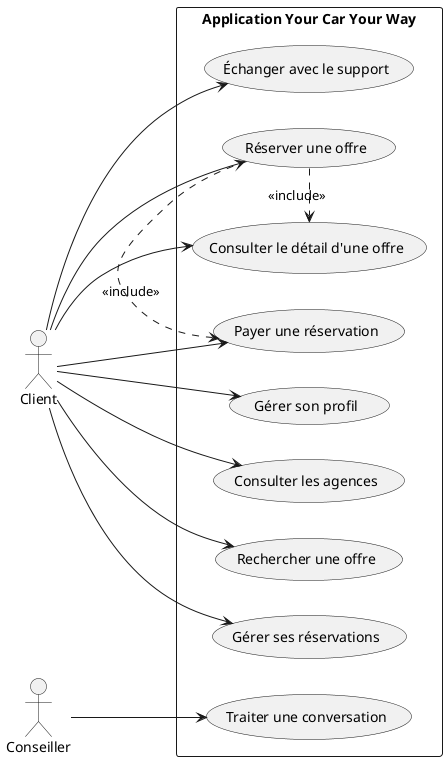
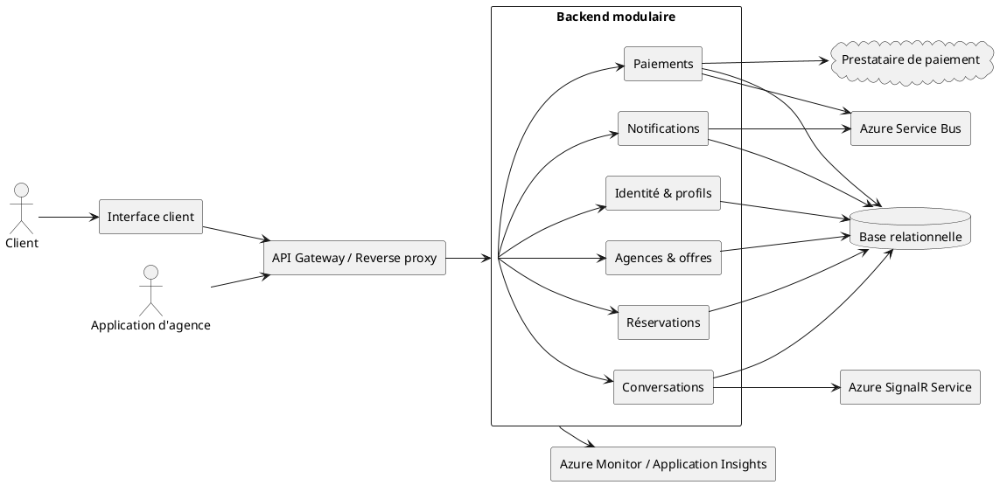
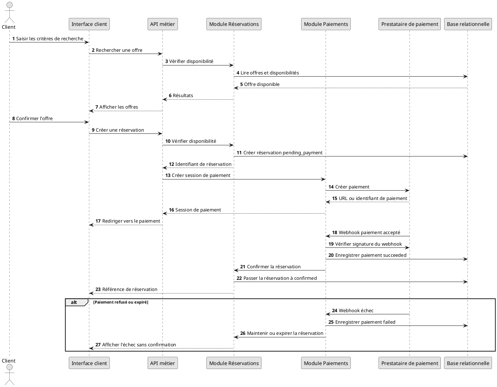
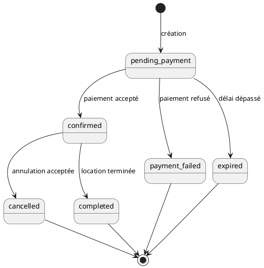
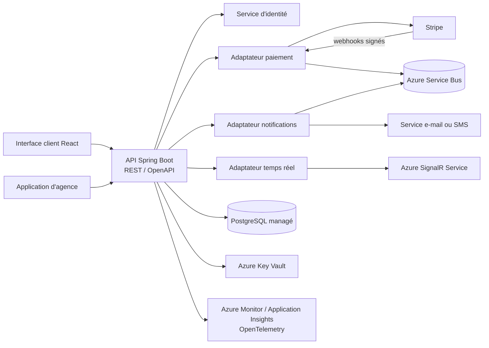
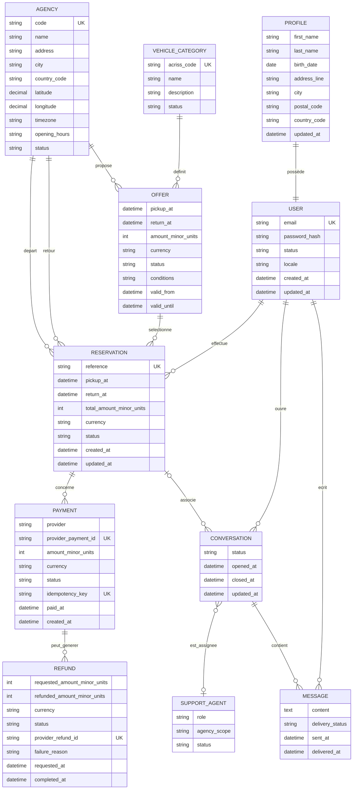

# Proposition d'architecture

## Objet

Ce document regroupe la synthèse de l'audit de l'existant, les spécifications techniques proposées et le modèle de données de la V1 de l'application Your Car Your Way.

Les choix indiqués comme « à valider » doivent être arbitrés avant le développement.

La récupération, la migration et la synchronisation des données ou fonctionnalités de
l'existant sont hors périmètre de cette proposition. La V1 est conçue comme une
application autonome ; les éventuels travaux de reprise feront l'objet d'un projet
distinct.

## 1. Audit de l'existant

### 1.1 Synthèse

Your Car Your Way dispose de plusieurs applications nationales développées indépendamment. L'architecture est majoritairement monolithique, les données sont isolées par pays et les APIs ne sont pas uniformisées.

Cette situation entraîne une duplication du code, une divergence des règles métier, des coûts de maintenance élevés et des niveaux de sécurité, de disponibilité et de fiabilité différents. La cible doit donc centraliser les contrats métier et les données nécessaires au parcours client, tout en isolant explicitement les règles locales.

### 1.2 Périmètre technique observé

| Périmètre | Technologie principale | Hébergement | Architecture |
| --- | --- | --- | --- |
| France | Java EE, JSP/JSF | OVH | Monolithe complet |
| Allemagne, Espagne, Italie | Java EE | OVH | Dérivés du produit français |
| Royaume-Uni | PHP Laravel | AWS EC2 | Monolithe isolé |
| Canada | React, Node.js | AWS | Frontend séparé, backend monolithique |
| États-Unis | Angular, Spring Boot | Azure App Services / Containers | Monolithe containerisé |

### 1.3 Principaux constats et risques

- Les APIs sont limitées, hétérogènes et non unifiées.
- Chaque pays dispose d'une base avec un schéma différent.
- Le partage d'informations est absent ou réalisé manuellement.
- Les déploiements historiques sont manuels ; les environnements cloud sont plus standardisés.
- Les performances et la disponibilité sont hétérogènes : disponibilité annoncée de 97,2 % à 98,9 %, MTTR d'environ 2 h 45 sur OVH contre 1 h 10 sur AWS/Azure.
- Les pics saisonniers provoquent jusqu'à 4 % d'erreurs sur FR/DE/ES/IT.
- Les sauvegardes historiques sont manuelles et les restaurations ne sont pas régulièrement testées.
- SHA-1 est utilisé pour les mots de passe FR/DE/ES/IT et TLS 1.0 subsiste en France et en Italie.
- Des secrets sont stockés dans des fichiers de configuration et la rotation n'est pas homogène.
- Les dépendances présentant des vulnérabilités sont particulièrement nombreuses sur les environnements historiques.

### 1.4 Recommandations de transition

- Définir un modèle métier et un contrat API communs.
- Centraliser les règles communes et isoler les règles locales par pays.
- Sécuriser en priorité les mots de passe, TLS, secrets et dépendances.
- Automatiser les déploiements, sauvegardes, contrôles et tests de restauration.
- Définir les objectifs de disponibilité, performance, RPO et RTO.
- Réaliser un pilote sur un périmètre limité avant la généralisation.

## 2. Spécifications techniques

### 2.1 Principes directeurs

- Centraliser les contrats métier, les règles communes et les données nécessaires au parcours client.
- Isoler les règles locales par pays sans dupliquer le cœur fonctionnel.
- Exposer une API versionnée et sécurisée pour l'application client et les applications en agence.
- Préférer une architecture modulaire et déployable simplement pour la V1.
- Rendre les opérations critiques traçables et conformes à la politique d'idempotence définie pour les réservations et paiements.
- Automatiser les tests, les déploiements, les sauvegardes et les contrôles de sécurité.

### 2.2 Architecture cible proposée

La cible recommandée est un backend modulaire centralisé, déployé sous forme de conteneurs stateless sur Azure, derrière un reverse proxy ou un load balancer. Cette orientation reprend le meilleur retour d'expérience de l'environnement américain tout en supprimant ses limites identifiées, notamment l'usage partiel d'Azure Key Vault et la non-redondance de la base. Les modules partagent une base relationnelle managée mais possèdent des responsabilités et des contrats séparés.

Modules fonctionnels proposés :

- identité et profils ;
- agences ;
- catalogue des catégories et offres ;
- disponibilité ;
- réservations ;
- paiements et remboursements ;
- notifications ;
- conversations et messages ;
- administration technique et audit ;
- intégrations avec les prestataires externes nécessaires au parcours cible.

Cette architecture pourra évoluer vers des services séparés si la charge, l'organisation ou les contraintes d'isolation le justifient. La séparation des modules doit être conçue dès la V1 pour éviter un monolithe indifférencié.

### 2.3 Diagrammes UML

#### Cas d'utilisation

#### Architecture logique

#### Séquence de réservation et de paiement

#### États d'une réservation

### 2.4 Composants techniques

| Composant | Responsabilité | Solution recommandée | Validation restante |
| --- | --- | --- | --- |
| Interface client | Profil, recherche, réservation, paiement, historique et tchat | React avec une bibliothèque de composants accessible et internationalisable | Compétences de l'équipe et conformité au référentiel d'accessibilité |
| API métier | Authentification, règles métier et exposition des ressources | Spring Boot modulaire et REST versionnée avec OpenAPI | Résultats du prototype de charge et compétences Java |
| Base relationnelle | Données transactionnelles et cohérence des réservations | PostgreSQL managé en haute disponibilité | Offre cloud, réplication et coûts |
| Cache et verrous | Cache de lecture et coordination des vérifications de disponibilité | Redis ou service équivalent, sans en faire la source de vérité | Dimensionnement et politique d'expiration |
| Bus ou file de messages | Notifications, webhooks et traitements asynchrones | Azure Service Bus avec files/topics et dead-letter queue | Technologie et garanties de livraison |
| Prestataire de paiement | Paiement et remboursement | Prestataire externe tel que Stripe | Prestataire contractuel et pays couverts |
| Service temps réel | Messages du tchat et événements de conversation | Azure SignalR Service | Gestion de la reconnexion, de l'autorisation et de la montée en charge |
| Fournisseur de notifications | E-mail, SMS ou autre canal validé | Service de notification derrière un adaptateur | Canaux et fournisseur à arbitrer |
| Déploiement | Exécution et livraison applicative | Azure avec conteneurs et chaîne CI/CD reproductible | Régions, niveau de service et coûts |
| Observabilité | Logs, métriques, traces et alertes | Azure Monitor et Application Insights avec instrumentation OpenTelemetry | Choix de rétention, coûts et tableaux de bord |
| Coffre de secrets | Secrets applicatifs et clés d'intégration | Azure Key Vault généralisé à tous les environnements | Rotation, séparation des coffres et procédure de secours |

### 2.5 API

Principes :

- L'API est exposée sous un préfixe versionné, par exemple `/api/v1`.
- Les réponses et erreurs suivent un format documenté et homogène.
- Les dates sont transmises dans un format normalisé avec le fuseau ou l'identifiant de zone nécessaire.
- Les montants sont transmis comme un entier exprimé dans l'unité minimale de la devise, avec une devise explicite.
- Les listes prennent en charge la pagination, le filtrage et le tri documentés.
- Les endpoints de création et de mutation critiques appliquent la politique d'idempotence définie en section 2.6.
- Le contrat est publié avec OpenAPI et versionné avec le code.

Ressources minimales :

- `/users` et `/profiles` ;
- `/agencies` ;
- `/vehicle-categories` ;
- `/offers` et `/searches` ;
- `/reservations` ;
- `/payments` et `/refunds` ;
- `/conversations` et `/messages` ;
- `/notifications` selon le canal retenu.

Les droits sont contrôlés côté serveur pour chaque ressource et chaque action. Les rôles minimaux sont le client, l'application d'agence, le conseiller et l'administrateur technique. Les permissions détaillées restent à valider.

### 2.6 Réservation et paiement

1. L'offre est relue et sa disponibilité est vérifiée au moment de la confirmation.
2. Une tentative de réservation est créée avec un état non confirmé.
3. Une session de paiement est créée auprès du prestataire externe.
4. Le résultat du paiement est reçu par retour utilisateur et par webhook vérifié.
5. Le webhook idempotent est la source de confirmation du paiement.
6. La réservation passe à l'état confirmée uniquement après paiement accepté.
7. Un paiement échoué ou expiré laisse une trace exploitable sans créer de réservation confirmée.

La réservation et la confirmation de disponibilité doivent être protégées contre les doubles réservations par transaction, verrouillage court ou mécanisme équivalent.

États minimaux :

- réservation : `pending_payment`, `confirmed`, `cancelled`, `completed`, `payment_failed`, `expired` ;
- paiement : `created`, `pending`, `succeeded`, `failed`, `refunded`, `partially_refunded` ;
- conversation : `open`, `assigned`, `closed`.

Pour une annulation effectuée moins d'une semaine avant le début de la location, le montant remboursé est limité à 25 % du montant total, sous réserve des règles complémentaires validées. Le montant demandé au prestataire, le montant réellement remboursé, l'état du remboursement et les erreurs doivent être conservés.

### 2.7 Sécurité

- TLS actuel et sécurisé uniquement ; TLS 1.0 et les protocoles obsolètes sont interdits.
- Mots de passe stockés avec un algorithme adaptatif moderne, par exemple Argon2id ou bcrypt.
- Secrets stockés dans un coffre dédié, jamais dans le dépôt ou des fichiers versionnés.
- Authentification renforcée pour les actions sensibles.
- Vérification de signature et d'anti-rejeu pour les webhooks de paiement.
- Contrôle d'accès côté serveur, journalisation des refus et limitation des tentatives sensibles.
- Dépendances inventoriées et analysées automatiquement.
- Données bancaires non stockées par l'application.
- Logs exempts de mots de passe, secrets et données bancaires.

### 2.8 Disponibilité, performance et résilience

Les objectifs chiffrés doivent être validés avant la production. La cible doit prévoir :

- plusieurs instances applicatives lorsque le niveau de disponibilité le requiert ;
- une base sauvegardée automatiquement et une procédure de restauration testée ;
- une stratégie de reprise documentée avec RPO et RTO validés ;
- des timeouts, retries bornés et circuit breakers pour les dépendances externes ;
- une file ou un mécanisme de reprise pour les notifications et traitements asynchrones ;
- des tests de charge sur les parcours de recherche, réservation et paiement ;
- une gestion explicite des erreurs de dépendance et des réponses dégradées.

### 2.9 Observabilité, accessibilité et écoconception

Les événements et métriques doivent suivre la disponibilité, la latence, les erreurs, les recherches, les réservations, les paiements, les remboursements, les appels API, les conversations, les déploiements, les sauvegardes et les restaurations. Chaque opération sensible possède un identifiant de corrélation et une trace horodatée.

Le référentiel d'accessibilité applicable, par exemple le RGAA ou les WCAG, doit être validé avant le développement. Les tests et critères de conformité seront définis dans les spécifications détaillées.

Les interfaces et APIs doivent limiter les volumes transférés, éviter les traitements inutiles et permettre le suivi du poids des principaux parcours. Les durées de conservation des données et logs doivent être limitées selon les obligations métier et réglementaires.

### 2.10 Déploiement et tests

- Le code est versionné et construit par une chaîne d'intégration continue.
- Les contrôles de qualité, tests et analyses de dépendances sont automatisés.
- Les environnements de développement, recette et production sont séparés.
- Les configurations et secrets sont injectés par l'environnement.
- Les tests couvrent les règles métier, l'intégration, les contrats API, les parcours, les autorisations, la résilience, la charge, l'accessibilité et la restauration.

### 2.11 Décisions à valider

- Confirmer les choix recommandés : React, Spring Boot, Azure conteneurisé et PostgreSQL managé.
- Valider l'hébergeur, les régions de déploiement et le niveau de service associé.
- Valider les résultats du test de charge, de l'audit de sécurité, du prototype d'accessibilité et de la comparaison des coûts.
- Configuration de Redis, Azure Service Bus et Azure SignalR Service.
- Fournisseur d'identité et parcours de compte.
- Rôles et permissions des applications d'agence.
- Canaux de notification.
- Objectifs de disponibilité, performance, RPO et RTO.
- Référentiel d'accessibilité et niveau de conformité.

### 2.12 Sélection et justification des solutions technologiques

Les choix sont orientés par les résultats observés dans l'existant. Les environnements cloud obtiennent de meilleurs résultats que les environnements OVH historiques sur la disponibilité, le MTTR, la réussite des déploiements et la stabilisation après mise à jour. Le périmètre américain est le plus performant avec 98,9 % de disponibilité, environ 350 requêtes par seconde et 0,8 % d'erreurs lors des pics ; il est également le seul à combiner conteneurisation et déploiement Azure. Le Canada apporte le meilleur retour d'expérience sur l'expérience utilisateur avec React.

La cible reprend donc le socle cloud et conteneurisé du périmètre américain, renforce l'usage d'Azure Key Vault qui n'y est que partiel, et s'inspire du frontend React canadien pour l'expérience client. Ces choix devront être confirmés par un test de charge, un audit de sécurité, un prototype d'accessibilité et une comparaison des coûts d'exploitation.

| Domaine | Solution proposée | Justification | Point à valider |
| --- | --- | --- | --- |
| Frontend | React, avec une bibliothèque de composants accessible et internationalisable | Le Canada fournit le meilleur retour d'expérience UX de l'existant ; React permet de capitaliser sur cette expérience tout en mutualisant l'interface client internationale | Compétences de l'équipe et conformité au référentiel d'accessibilité |
| Backend | Spring Boot modulaire | Le périmètre américain associe Spring Boot à la meilleure performance observée ; la modularité centralise les règles métier sans imposer la complexité opérationnelle de microservices dès la V1 | Compétences Java et résultats du prototype de charge |
| API | REST versionnée avec contrat OpenAPI | Compatible avec les applications web et d'agence, testable et documentable | Besoin éventuel d'événements exposés en complément |
| Base de données | PostgreSQL managé en haute disponibilité | Une base relationnelle est nécessaire pour les transactions et contraintes des réservations ; le service managé réduit les opérations manuelles constatées dans l'existant | Offre cloud, réplication et coûts |
| Cache et verrous | Redis ou service équivalent, uniquement pour les usages nécessaires | Réduit la latence et aide à coordonner les vérifications de disponibilité sans devenir la source de vérité | Dimensionnement et politique d'expiration |
| Traitements asynchrones | Azure Service Bus avec files/topics et dead-letter queue | Découple notifications, webhooks et traitements pouvant être rejoués, tout en isolant les messages en échec | Volumes, garanties de livraison et politique de rétention |
| Temps réel | Azure SignalR Service | Fournit les connexions temps réel du tchat et des événements sans gérer directement la montée en charge des connexions WebSocket | Gestion de la reconnexion, de l'autorisation et des coûts |
| Paiement | Prestataire externe tel que Stripe | Évite le stockage des données bancaires et fournit des APIs de paiement et remboursement | Prestataire contractuel et pays couverts |
| Déploiement | Azure avec conteneurs et chaîne CI/CD reproductible | Le périmètre américain, déployé sur Azure avec des conteneurs, obtient les meilleurs indicateurs de disponibilité, charge, erreurs et stabilisation ; cette approche corrige les déploiements manuels OVH | Régions, niveau de service et maîtrise du verrouillage fournisseur |
| Gestion des secrets | Azure Key Vault généralisé à tous les environnements | Le périmètre américain utilise déjà Key Vault pour l'API ; sa généralisation corrige le stockage de secrets en fichiers et l'usage partiel observés | Rotation, séparation des coffres et procédure de secours |
| Observabilité | Azure Monitor et Application Insights avec instrumentation OpenTelemetry | Centralise les logs, métriques, traces distribuées, alertes et tableaux de bord des opérations sensibles | Rétention, coûts et tableaux de bord d'exploitation |

Le choix final devra être documenté dans une matrice de décision comprenant les critères, la pondération, les options étudiées, les résultats des essais et les conséquences du choix. Aucun composant ne doit être sélectionné uniquement pour reproduire une technologie historique d'un pays.

### 2.13 Modélisation de l'intégration des composants tiers

Les composants tiers sont intégrés derrière des adaptateurs dédiés afin d'isoler leurs contrats, leurs erreurs et leurs évolutions du cœur métier. Les appels externes doivent être authentifiés, limités dans le temps, journalisés avec un identifiant de corrélation et protégés par des retries bornés ou un mécanisme de reprise adapté.

Principes d'intégration :

- le système central est la source de vérité pour les réservations créées dans la nouvelle application ;
- chaque prestataire possède un adaptateur et un contrat interne indépendant de son SDK ;
- les webhooks de paiement appliquent la politique d'idempotence de la section 2.6 et sont rejouables sans double confirmation ;
- les indisponibilités d'un service externe produisent un état explicite et ne doivent pas confirmer une réservation à tort ;
- les notifications et traitements non critiques peuvent être asynchrones et repris après incident ;
- les clés, certificats, URLs et identifiants de prestataires sont fournis par la configuration sécurisée de l'environnement ;
- les contrats des intégrations sont testés avec des tests de contrat et des environnements de test des fournisseurs.

### 2.14 Bonnes pratiques transverses

#### Sécurité, accessibilité et impact écologique

Les exigences détaillées sont définies dans les sections [Sécurité](#27-sécurité) et [Observabilité, accessibilité et écoconception](#29-observabilité-accessibilité-et-écoconception). Les bonnes pratiques suivantes guident leur mise en œuvre :

- appliquer le principe du moindre privilège et tracer les opérations sensibles ;
- intégrer les contrôles de sécurité, d'accessibilité et de sobriété dans la conception, le développement, les tests et l'exploitation ;
- analyser les dépendances, les configurations et les images de déploiement à chaque livraison ;
- suivre les écarts avec une priorité, un responsable et une date de correction ;
- documenter les compromis entre sécurité, accessibilité, performance, disponibilité et impact écologique.

## 3. Modèle de données

### 3.1 Principes

Le modèle proposé utilise une base relationnelle transactionnelle. Les données communes sont centralisées, tandis que les règles ou paramètres propres à un pays sont identifiés explicitement.

- Les identifiants techniques sont des UUID ou un format équivalent non prédictible.
- Les montants sont stockés comme des entiers exprimés dans l'unité minimale de la devise, avec une devise explicite.
- Les dates métier sont stockées au format UTC et converties lors de l'affichage.

### 3.2 Diagramme entité-relation

### 3.3 Entités et contraintes

#### Utilisateur et profil

`USER` contient les informations d'authentification et l'état du compte. `PROFILE` contient les informations personnelles modifiables.

- L'adresse e-mail est unique.
- Le mot de passe n'est jamais stocké en clair.
- Un utilisateur ne peut consulter ou modifier que son propre profil.
- La suppression du compte respecte la politique de conservation et les règles concernant les réservations futures.

#### Agence, catégorie et offre

`AGENCY` contient les informations d'affichage et de localisation. Le fuseau horaire est indispensable à l'interprétation des dates. `VEHICLE_CATEGORY` référence les codes ACRISS. `OFFER` représente une possibilité tarifée pour une période, deux agences et une catégorie.

- Le code d'agence et le code ACRISS sont uniques.
- Une agence inactive ne peut pas être proposée pour une nouvelle réservation.
- Une offre doit avoir une date de retour postérieure au départ.
- Le montant et la devise sont obligatoires.
- Une offre ne peut être réservée que si elle est disponible au moment de la confirmation.

#### Réservation

`RESERVATION` conserve un instantané des informations importantes de l'offre au moment de la réservation afin de préserver l'historique.

- La référence est unique et une réservation appartient à un seul client.
- L'état suit les transitions définies dans les spécifications techniques.
- Les mutations critiques sont idempotentes, contrôlées par les droits et journalisées.
- Les dates, agences, catégorie, montant et devise utilisés à la confirmation restent traçables.

#### Paiement et remboursement

`PAYMENT` représente une opération auprès du prestataire externe. `REFUND` représente une demande et son résultat. Aucun numéro de carte ni secret bancaire ne doit être stocké.

- L'identifiant du prestataire est unique.
- Un webhook accepté est traité de manière idempotente.
- Une réservation n'est confirmée qu'après paiement accepté.
- Une annulation à moins d'une semaine entraîne un remboursement limité à 25 % du montant total, sous réserve des règles validées.
- Les montants demandés et réellement remboursés, le statut et les erreurs sont conservés.

#### Conversations

`CONVERSATION` appartient à un client et peut être associée à une seule réservation. `MESSAGE` conserve l'ordre, l'auteur et l'état de remise.

- Seuls les participants et les personnes habilitées accèdent aux messages.
- Un message vide est refusé.
- La clôture ne supprime pas l'historique.
- L'affectation et le transfert respectent les permissions du conseiller.
- Les contenus conservés sont soumis à une durée de rétention à valider.

### 3.4 Contraintes et données à préciser

- Empêcher que `return_at` soit antérieur ou égal à `pickup_at`.
- Garantir l'unicité des identifiants de paiement, remboursement et clés d'idempotence.
- Définir le modèle exact des disponibilités et des allocations de véhicules.
- Définir la granularité des tarifs et des taxes.
- Définir les règles de conservation et d'anonymisation.
- Définir les horaires d'ouverture, jours fériés et permissions par agence.
- Définir les données nécessaires aux notifications et préférences de contact.

## Références détaillées

- [Audit détaillé de l'existant](docs/audit_existant.md)
- [Spécifications techniques détaillées](docs/specifications_techniques.md)
- [Modèle de données détaillé](docs/modele_donnees.md)
- [Diagrammes PlantUML](docs/diagrammes_uml.puml)
